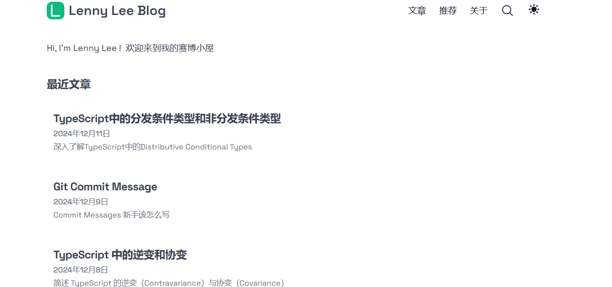
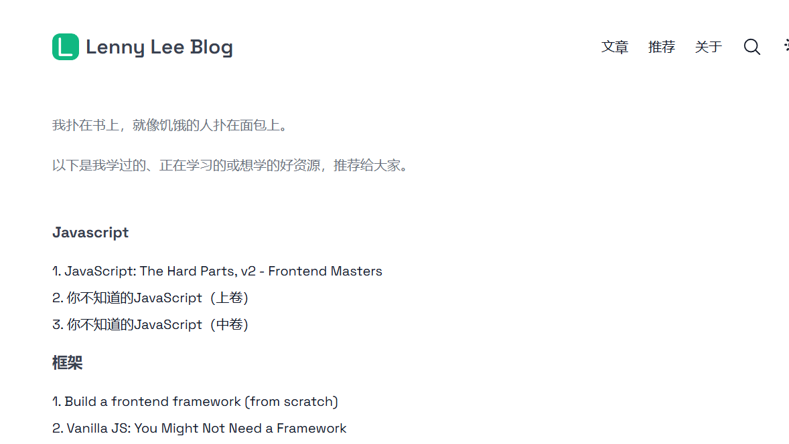

# Lenny's Blog

A modern, feature-rich technical blog built with **Next.js 14**, **TypeScript**, and **Tailwind CSS**.
Based on the [Tailwind Next.js Starter Blog](https://github.com/timlrx/tailwind-nextjs-starter-blog) template,
with a focus on content about web development, TypeScript, and software engineering.

[Live Demo](https://lenny-blog.vercel.app/) · [View Blog](https://lenny-blog.vercel.app/) ·
[GitHub](https://github.com/LennyLee1998/lenny-blog)

---

## 📸 截图

首页、推荐页和关于页的样子：

  
  

> 图片里的文字是中文，因为我的博客主要写中文技术文章。

---

## 👤 关于我

我是 **Lenny Lee**
博客就是我的第二大脑，用来做笔记、写心得、记录成长。  
技术栈主要是 React/Next.js、TypeScript、Tailwind，写的文章：

- TypeScript 类型诀窍
- JavaScript 深层原理
- 前端性能与架构
- 算法与数据结构
- 软件工程实践

想看更多请访问 [博客首页](https://lenny-blog.vercel.app)

---
